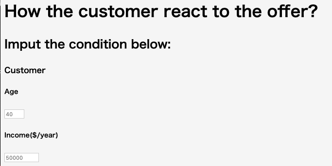
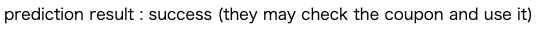

# Starbucks Capstone Challenge
## Table of Content]
[Project Overview](#project_overview)  
[Installation](#installation)  
[File Descriptions](#file_description)  
[Summary](#summary)  
[Acknowledgements](Acknowledgements)  
## Project Overview
This project is about discovering what is the best offer for starbucks customers, not just for the population as a whole but an individual personalized level.

This is a classifier that predicts customer response by entering customer and offer information. The metric is the accuracy of the estimator.

prediction input page view  
  

prediction result view   
  
 

### The motivation for the project
In the past, mass marketing such as commercials and advertisements was the mainstream, but with the spread of the Internet, it has become necessary to carry out promotional measures tailored to each customer. In 1 to 1 marketing, by implementing promotions that are suitable for the customer, it is possible to make a good impression on the customer and at the same time optimize the business cost by appropriately distributing the promotion expenses.

Starbucks sends out an offer to users of the mobile app once every few days. An offer can be merely an advertisement for a drink or an actual offer such as a discount or BOGO (buy one get one free). Not all users receive the same offer.

The project goal is to combine transaction, demographic and offer data to determine which customer respond best to which offer type.

### Prediction strategy
When Starbucks sends customers some discount promotions(BOGO and DISCOUNT), the reactions are classified into below:

view -> complete (success)  
 customers check the promotion and react on it. It's succes of the promotion offer.  
view -> NOT complete (fail)  
 customers check the promotion but they don't use it.  
Not view -> complete (no_contribute)  
 customers don't check the promotion but they use the promotion offer. the offer doesn't affect to the customer however the promotion costs.  
Not view -> NOT complete (no_interest)  
 customers neither check and use the promotion offer.  

From the perspective of business cost performance, Starbuckswant to increase success and decrease no_contribute. I'd like to create a classification ML program to predict how customers react to a certain offer.

screenshot of the output

## Installation
For running this project, the most important library is Python version of Anaconda Distribution. It installs all necessary packages for analysis and building models.

version
Python 3.7.4
pandas 0.25.1
numpy 1.17.2
seaborn 0.9.0
matplotlib 3.1.1
sklearn 0.21.3

### Instructions
1. Run the following commands in the project's root directory to set up your database and model.

- To run clean_data.py which cleans data and stores in database   
'python data/data_clean.py data/portfolio.json data/profile.json data/transcript.json'
- To run ML pipeline which trains classifier and saves   
'python model/estimator.py data/data_clean.db model/classifier.pkl' 

2. Run the following command in the app's directory to run the web app.
    'python run.py'

3. Go to http://127.0.0.1:5000/

- To run ML pipeline to estimate your data.   
'python data_to_estimate/run_estimator.py data_to_estimate/'

## File Descriptions
### File and Structure
┣ README.md - this file  
┣ Starbucks_Capstone_notebook.ipynb - analyze data and draw figures  
┣ classifier_output.png - output image   
┣ data  
┃ ┣ clean_data.db - clean data after running data_clean.py  
┃ ┣ data_clean.py - python to clean data  
┃ ┣ portfolio.json - containing offer details  
┃ ┣ profile.json - user profiles  
┃ ┗ transcript.json - records for transactions and offers  
┣ data_to_estimate    
┃ ┣ estimate_data.csv - sample data to predict (can replace or modify to yours)    
┃ ┗ run_estimator.py     - python to run the estimator  
┗ data    
 ┣ classifier.pkl - classifier after running estimator.py  
 ┗ estimator.py - python to create the classifier

### Dataset Overview
The dataset contains simulated data that mimics customer behavior on the Starbucks rewards mobile app. Once every few days, Starbucks sends out an offer to users of the mobile app. An offer can be merely an advertisement for a drink or an actual offer such as a discount or BOGO (buy one get one free).

- profile.json Rewards program users (17000 users x 5 fields)
gender: (categorical) M, F, O, or null
age: (numeric) missing value encoded as 118
id: (string/hash)
became_member_on: (date) format YYYYMMDD
income: (numeric)

- portfolio.json Offers sent during 30-day test period (10 offers x 6 fields)  
reward: (numeric) money awarded for the amount spent  
channels: (list) web, email, mobile, social  
difficulty: (numeric) money required to be spent to receive reward  
duration: (numeric) time for offer to be open, in days  
offer_type: (string) bogo, discount, informational  
id: (string/hash)  

- transcript.json Event log (306648 events x 4 fields)  
person: (string/hash)  
event: (string) offer received, offer viewed, transaction, offer completed  
value: (dictionary) different values depending on event type  
offer id: (string/hash) not associated with any "transaction"  
amount: (numeric) money spent in "transaction"  
reward: (numeric) money gained from "offer completed"  
time: (numeric) hours after start of test  

## Summary
The accuracy of the classifier is 0.6082.

### for the future improvement
This time, we made predictions only for coupon offers with discounts. If you want to measure the effect of information provision, it is possible to analyze it in time series together with transaction data. I am simplifying the case where I receive the same offer multiple times. For example, if a person received the same offer three times, saw it twice, and used it once, it was classified as success. In order to improve the prediction accuracy, it is necessary to consider a data storage method that correlates at what time the coupon was sent and when it was opened. In order to make the UX more considerate of marketing, when inputting the offer conditions, it may be possible to extract the customer list that responds to the offer in descending order of probability.

## Acknowledgements
This is an assignment in Data Scientist Nanodegree program in Udacity. I appreciate the teachers and mentors who encourage me to brush up the skills as a data scientist. Also, I really thank to Starbucks, which provides me a great opportunity to analyze the data based on the real business.
